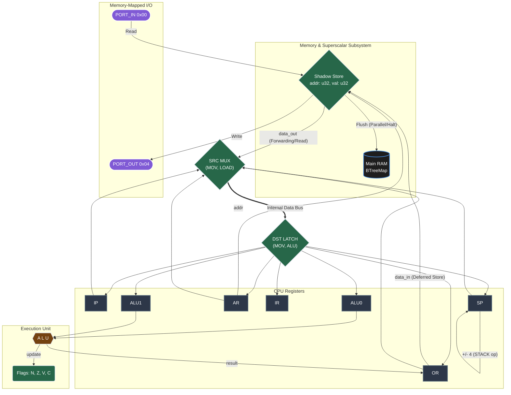
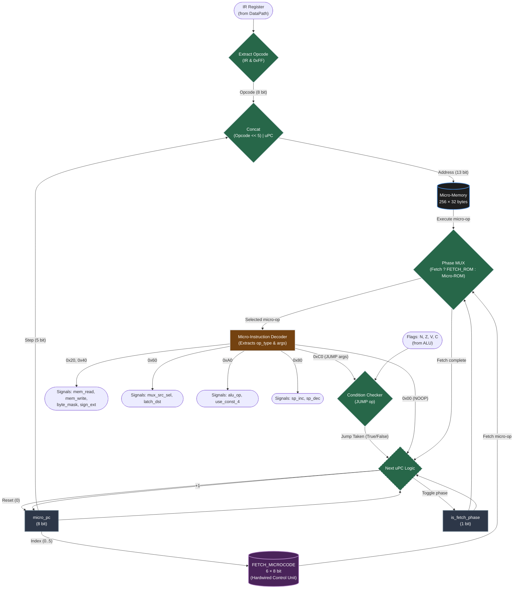

# Лабораторная работа №4. Эксперимент

* ФИО: Бущик Иван
* Группа: P3232
* Вариант: `alg | stack | neum | mc | tick | binary | stream | mem | cstr | prob2 | superscalar`

## Язык программирования

Разработан язык программирования **Ferrite**. Синтаксис вдохновлен Rust/C (вариант `alg`).

### Синтаксис

```ebnf
<program>     ::= <item>*
<item>        ::= <mod_decl> | <use_decl> | <const_decl> | <fn_decl>

<vis>         ::= "pub"?
<type_name>   ::= "i32" | "u32" | "i8" | "u8" | "cstr" | "bool"

<mod_decl>    ::= <vis> "mod" <ident> (";" | "{" <item>* "}")
<use_decl>    ::= <vis> "use" <use_tree> ";"
<use_tree>    ::= <path> "::" ("*" | <use_group>) | <path> | "*"
<use_group>   ::= "{" <use_tree> ("," <use_tree>)* ","? "}"

<const_decl>  ::= <vis> "const" <ident> ":" <type_name> "=" <expr> ";"
<fn_decl>     ::= <vis> "fn" <ident> "(" <params>? ")" ("->" <type_name>)? <block>
<params>      ::= <param> ("," <param>)*
<param>       ::= <ident> ":" <type_name>

<block>       ::= "{" <statement>* "}"

<statement>   ::= <let_decl> | <if_stmt> | <while_stmt> | <break_stmt>
                | <continue_stmt> | <return_stmt> | <assign_stmt> | <expr_stmt>

<let_decl>    ::= "let" "mut"? <ident> (":" <type_name>)? "=" <expr> ";"
<if_stmt>     ::= "if" <expr> <block> ("else" (<if_stmt> | <block>))?
<while_stmt>  ::= "while" <expr> <block>
<break_stmt>  ::= "break" ";"
<continue_stmt> ::= "continue" ";"
<return_stmt> ::= "return" <expr>? ";"
<assign_stmt> ::= (<deref_target> | <index_expr> | <path>) <assign_op> <expr> ";"
<deref_target> ::= "*" <primary>

<assign_op>   ::= "+=" | "-=" | "*=" | "/=" | "%=" | "&=" | "|=" | "^=" | "<<=" | ">>=" | "="
<expr_stmt>   ::= <expr> ";"

<expr>        ::= <logic_or>
<logic_or>    ::= <logic_and> ("||" <logic_and>)*
<logic_and>   ::= <bit_or> ("&&" <bit_or>)*
<bit_or>      ::= <bit_xor> ("|" <bit_xor>)*
<bit_xor>     ::= <bit_and> ("^" <bit_and>)*
<bit_and>     ::= <equality> ("&" <equality>)*
<equality>    ::= <comparison> (("==" | "!=") <comparison>)*
<comparison>  ::= <shift> (("<=" | ">=" | "<" | ">") <shift>)*
<shift>       ::= <addition> (("<<" | ">>") <addition>)*
<addition>    ::= <multiplication> (("+" | "-") <multiplication>)*
<multiplication> ::= <unary> (("*" | "/" | "%") <unary>)*
<unary>       ::= ("-" | "!" | "~" | "*")* <primary>

<primary>     ::= "(" <expr> ")"
                | <reserve_expr>
                | <call_expr>
                | <index_expr>
                | <literal>
                | <path>

<reserve_expr> ::= "reserve" "::<" <type_name> ">" "(" <literal_int> ")"
<call_expr>   ::= <path> "(" <expr> ("," <expr>)* ")"
<index_expr>  ::= <path> "[" <expr> "]"

<literal>     ::= <hex_literal> | <dec_literal> | <char_literal> | <string_literal> | <bool_literal>
<literal_int> ::= <hex_literal> | <dec_literal>
<dec_literal> ::= "-"? [0-9]+
<hex_literal> ::= "0x" [0-9a-fA-F]+
<char_literal> ::= "'" <any_char> "'"
<string_literal> ::= "\"" <any_char>* "\""
<bool_literal> ::= "true" | "false"

<path>        ::= <ident> ("::" <ident>)*
<ident>       ::= [a-zA-Z] [a-zA-Z0-9_]*
```

### Семантика

* **Стратегия вычислений**: Строгая (eager evaluation). Аргументы функций и операнды операторов вычисляются до применения операции.
* **Типизация**: Статическая, слабая для числовых типов (в духе языка C). Доступны типы `i32`, `u32`, `i8`, `u8`, `cstr` (C-строка), `bool`. Язык разрешает неявное смешение числовых типов в бинарных операциях (например, `u8` + `i32`), так как аппаратно все значения расширяются до 32-битных машинных слов. Однако типы строго используются компилятором для генерации специфичного машинного кода (например, выбор между арифметическим и логическим сдвигом, или генерация SMC-кода для побайтового доступа к cstr против словарного доступа к `i32`).
* **Область видимости**: Блочная (лексическая). Переменные, объявленные через `let`, видны до конца блока `{}`. Параметры функций видны в теле функции. Модульная система с `mod`/`use`.
* **Литералы**: Целые числа (десятичные и `0x`-шестнадцатеричные), символы (`'a'`), строки (`"hello"`), булевы (`true`/`false`). Числовые литералы могут быть отрицательными.
* **Управление памятью**: Ручное для глобальных массивов (`reserve::<T>(size)`), автоматическое для локальных переменных (размещаются на стеке).
* **Строки (cstr)**: Null-terminated. Символ занимает 1 машинное слово (32 бита). Доступ по индексу через `arr[i]` реализован транслятором через SMC (самомодифицирующийся код) или арифметику указателей.

### Отображение выражений на стек

Поскольку архитектура стековая, сложные арифметические/логические выражения транслируются в обратную польскую нотацию (RPN). Транслятор выполняет обход AST в глубину (post-order): операнды кладутся на стек, операция снимает операнды и кладёт результат.

Пример: `a + b * c` компилируется в:
```asm
PushR a       ; a
PushR b       ; a, b
PushR c       ; a, b, c
Mul           ; a, (b*c)
Add           ; (a + b*c)
```

Короткое замыкание `&&` и `||` реализовано через условные переходы (Jne/Jeq) с паттерном обхода.

### AST

Транслятор строит AST (типы в `crates/translator/src/ast.rs`, все типы `Debug`). Проверка AST осуществляется в модульных тестах транслятора через форматный вывод. AST человекочитаем за счёт `#[derive(Debug)]`.

## Организация памяти

Архитектура: Фон Неймановская -- код и данные в едином адресном пространстве.

* **Машинное слово**: 32 бита (4 байта).
* **Адресация**: Прямая (абсолютная), относительная (относительно SP для локальных переменных), косвенная (через AR).
* **Память**: Однопортовая (одно чтение или запись за такт).

### Регистры процессора

| Регистр | Размер | Назначение |
|---|---|---|
| `IP` | 32 | Instruction Pointer (указатель инструкций) |
| `IR` | 32 | Instruction Register (текущая инструкция) |
| `AR` | 32 | Address Register (адрес для доступа к памяти) |
| `SP` | 32 | Stack Pointer (указатель стека, растёт вверх) |
| `OR` | 32 | Operand Register (вход/выход ALU, данные памяти) |
| `ALU0`, `ALU1` | 32 | Входные регистры ALU |
| `micro_pc` | 8 | Микро-счётчик (0..31) |
| `N`, `Z`, `V`, `C` | 1 | Флаги ALU (Negative, Zero, oVerflow, Carry) |
| `ShadowStore` | 64 | Теневой регистр `(addr, val)` для Superscalar |
| `is_fetch_phase` | 1 | Флаг фазы: `true` — выборка, `false` — исполнение |

### Карта памяти

```text
0x0000_0000 : PORT_IN  (чтение, Memory-mapped I/O)
0x0000_0004 : PORT_OUT (запись, Memory-mapped I/O)
0x0000_1000 : Начало сегмента инструкций (Program Code)
...
<code_end>  : Сегмент статических данных (строковые литералы, reserve-буферы)
...
0x8000_0000 : Дно стека (Stack, растёт вверх — к старшим адресам)
```

### Работа с литералами, константами, переменными

* **Литералы**: Числовые литералы кодируются непосредственно как аргумент инструкции `PushConst <val>`.
* **Строковые литералы**: Размещаются в сегменте данных (после кода). В стек кладётся указатель на начало строки. Строки null-terminated (cstr).
* **Константы** (`const`): Вычисляются на этапе трансляции. Каждое использование константы заменяется на `PushConst <val>` (подстановка).
* **Локальные переменные**: Хранятся на стеке. Адресация через `PushR <offset>` и `StoreR <offset>` (offset = смещение относительно SP, вычисленное транслятором через отслеживание глубины стека).
* **Глобальные массивы** (`reserve::<T>(n)`): Размещаются в сегменте статических данных. `reserve` возвращает указатель (адрес начала блока).
* **Параметры функций**: Передаются через стек (caller кладёт аргументы перед `CallAddr`, callee обращается через `PushR` с положительным смещением выше `SP`).

### Работа с инструкциями и процедурами

* **Инструкции**: Кодируются в бинарном виде (1 байт опкод + 4 байта аргумент, если требуется). Размещаются последовательно, начиная с адреса `0x1000`.
* **Процедуры**: Вызов через `CallAddr <addr>` (кладёт IP+4 на стек, переходит по адресу). Возврат через `Ret` (снимает адрес со стека в IP).
* **Прерывания**: Нет.

## Система команд

Архитектура: **Стековая**. Все операции с данными работают через стек. Арифметические и логические операции снимают операнды с вершины стека и помещают результат обратно.

### Управление: Микропрограммное

Каждая машинная инструкция раскладывается на последовательность микроопераций. Процессор имеет две фазы:

* **Фаза выборки (Fetch)**: Выполняется неизменяемая «аппаратная» микропрограмма из `FETCH_MICROCODE` (6 микроопераций — часть Control Unit). Загружает слово из памяти по `IP` в `IR`, инкрементирует `IP`.
* **Фаза исполнения (Execute)**: Микропрограмма из Micro-ROM (256 × 32 байт), определяемая опкодом инструкции.

Флаг `is_fetch_phase` переключает фазы. Микро-счётчик (`micro_pc`, 0..31) перебирает микрошаги внутри фазы.

Жизненный цикл:

1. Фаза выборки: 6 тактов, `FETCH_MICROCODE` → `IR = mem[IP]`, `IP += 4`.
2. Декодирование опкода (младший байт `IR`).
3. Фаза исполнения: микрооперации из `micro_memory[opcode << 5 | micro_pc]`.
4. По достижении NOOP (0) или при взятом условном переходе — сброс `micro_pc` в 0, переход к фазе выборки.

### Микрооперации

Микроинструкция кодируется в 1 байт: старшие 3 бита — тип, младшие 5 — аргументы.

| Тип | Код | Описание |
|---|---|---|
| LOAD | `0x20` | `OR = mem[AR]` (с опциями byte-extract, sign-extend) |
| STORE | `0x40` | `mem[AR] = OR` (с опцией byte-mask) |
| MOV | `0x60` | Пересылка между регистрами (`OR/SP/IP/AR` → `OR/SP/IR/AR/IP/ALU0/ALU1`) |
| STACK | `0x80` | `SP += 4` (INC) или `SP -= 4` (DEC) |
| ALU | `0xA0` | Выполнить операцию ALU над `ALU0`/`ALU1`, результат в `OR`, флаги обновляются |
| JUMP | `0xC0` | Условный переход: если `condition(flags)`, то `IP = AR` |
| NOOP | `0x00` | Завершение микропрограммы |

### Набор инструкций

Каждая инструкция — 1 байт опкод + опционально 4 байта immediate-аргумент (Little-endian). Количество микротактов указано в столбце **µOPs**.

**Операции со стеком:**

| Инструкция | Опкод | µOPs | Описание |
|---|---|---|---|
| `PushConst <val>` | `0x05` | 5 | `SP+=4; mem[SP]=val; IP+=4` |
| `PushAddr <addr>` | `0x01` | 9 | `SP+=4; mem[SP]=mem[addr]; IP+=4` |
| `PushR <offset>` | `0x06` | 10 | `SP+=4; mem[SP]=mem[SP-offset]; IP+=4` |
| `PushByte <val>` | `0x02` | 5 | `SP+=4; mem[SP]=zero_extend(val); IP+=1` |
| `PushSignedByte <val>` | `0x03` | 5 | `SP+=4; mem[SP]=sign_extend(val); IP+=1` |
| `PushSignedByteW <val>` | `0x04` | 5 | как PushSignedByte, но IP+=4 |
| `Pop` | `0x08` | 1 | `SP-=4` |
| `Swap` | `0x0B` | 14 | Обмен `mem[SP]` и `mem[SP-4]` (XOR swap) |
| `Dup` | `0x0C` | 4 | Дублирование вершины |
| `Over` | `0x0D` | 5 | Копия `mem[SP-4]` на стек |
| `Ext` | `0x07` | 1 | `SP+=4` (расширение стека) |

**Операции с памятью:**

| Инструкция | Опкод | µOPs | Описание |
|---|---|---|---|
| `WriteAddr <addr>` | `0x09` | 12 | `mem[addr]=mem[SP]; IP+=4` |
| `StoreAddr <addr>` | `0x0A` | 13 | `mem[addr]=mem[SP]; SP-=4; IP+=4` |
| `StoreR <offset>` | `0x2A` | 14 | `mem[SP-offset]=mem[SP]; SP-=4; IP+=4` |

**Арифметика и логика (бинарные):**

Все бинарные операции имеют 8 µOPs: снимают два верхних значения со стека, вычисляют, кладут результат.

| Инструкция | Опкод | Описание |
|---|---|---|
| `Add` | `0x0E` | Сложение |
| `Sub` | `0x0F` | Вычитание |
| `Mul` | `0x10` | Умножение |
| `Div` | `0x11` | Деление |
| `Mod` | `0x12` | Остаток |
| `Or` | `0x13` | Битовое ИЛИ |
| `And` | `0x14` | Битовое И |
| `Xor` | `0x15` | Битовое исключающее ИЛИ |

**Унарные операции (4 µOPs):**

| Инструкция | Опкод | Описание |
|---|---|---|
| `Not` | `0x16` | Побитовое НЕ |
| `Inc` | `0x17` | Инкремент на 1 |
| `Dec` | `0x18` | Декремент на 1 |
| `Inc4` | `0x19` | Инкремент на 4 |
| `Dec4` | `0x1A` | Декремент на 4 |

**Сдвиги (8 µOPs):**

| Инструкция | Опкод | Описание |
|---|---|---|
| `Ls` | `0x1B` | Логический сдвиг влево |
| `Rs` | `0x1C` | Логический сдвиг вправо |
| `Ars` | `0x1D` | Арифметический сдвиг вправо |
| `Lcs` | `0x1E` | Циклический сдвиг влево |
| `Rcs` | `0x1F` | Циклический сдвиг вправо |

**Управление потоком:**

| Инструкция | Опкод | µOPs | Описание |
|---|---|---|---|
| `JumpAddr <addr>` | `0x20` | 3 | `IP=addr` |
| `JeqAddr <addr>` | `0x21` | 11 | Если Z=1: `IP=addr` |
| `JneAddr <addr>` | `0x22` | 11 | Если Z=0: `IP=addr` |
| `JgtAddr <addr>` | `0x23` | 11 | Если `(N==V && !Z)`: `IP=addr` |
| `JltAddr <addr>` | `0x24` | 11 | Если `(N!=V)`: `IP=addr` |
| `JgeAddr <addr>` | `0x25` | 11 | Если `(N==V)`: `IP=addr` |
| `JleAddr <addr>` | `0x26` | 11 | Если `(N!=V \|\| Z)`: `IP=addr` |
| `CallAddr <addr>` | `0x27` | 14 | `SP+=4; mem[SP]=IP+4; IP=addr` |
| `Ret` | `0x28` | 4 | `IP=mem[SP]; SP-=4` |
| `Wret` | `0x29` | 6 | `IP=mem[SP]; SP-=8` (возврат с уничтожением аргумента) |
| `Halt` | `0x00` | 1 | Останов процессора |

### Кодирование инструкций

Представление: **бинарное**. Файл `.bin` содержит последовательность байт (Little-endian word).

Формат:
```
<опкод:1 байт> [<аргумент:4 байта>]
```

Инструкции без аргумента (Halt, Pop, Swap, Dup, Over, Ext, арифметика, Not, Inc, Dec, Inc4, Dec4, сдвиги, Ret, Wret):
```
0x08        ; Pop
0x0E        ; Add
```

Инструкции с 4-байтным аргументом (PushConst, PushAddr, PushR, WriteAddr, StoreAddr, StoreR, Jump, Call, условные переходы):
```
0x05 0x2A 0x00 0x00 0x00  ; PushConst 42
0x27 0x20 0x10 0x00 0x00  ; CallAddr 0x1020
```

Инструкции с 1-байтным аргументом (PushByte, PushSignedByte):
```
0x02 0x41                  ; PushByte 'A'
0x03 0xFF                  ; PushSignedByte -1
```

Файл `.bin` начинается с кода по адресу `0x1000`. Данные (строки и `reserve`) дописываются после последней инструкции. Адреса патчатся в фазе линковки.

## Транслятор

Транслятор реализован в виде CLI-утилиты **`forgery`** (Rust, крейт `crates/forgery/`).

### Интерфейс командной строки

```
forgery build <file.ferrite>    Трансляция в <file>.bin
forgery run <file.ferrite>      Трансляция + запуск (stdin/stdout)
  -v                            Tracing инструкций
  -vv                           Tracing микроопераций
forgery test <file.toml>        Запуск golden-тестов
```

### Принцип работы

1. **Лексический и синтаксический анализ**: PEG-грамматика (`crates/translator/src/ferrite.pest`) обрабатывается библиотекой `pest`. Формируется AST (`crates/translator/src/ast.rs`).

2. **Разрешение модулей**: Подгрузка `mod` из файловой системы или встроенной std (`crates/translator/std/`). Автоматическое подключение `std` если не определён пользователем.

3. **Компиляция** (один проход по AST):
   * Сбор символов (функций, констант, модулей).
   * Разрешение `use` (алиасы, glob, вложенные пути).
   * Генерация байт-кода для каждой функции с отслеживанием глубины стека для расчёта смещений локальных переменных.
   * Эмиссия SMC (самомодифицирующийся код) для доступа к `i8`/`u8` через маскирование байт внутри 32-битного слова.
   * Короткое замыкание `&&`/`||` через условные переходы.

4. **Линковка**: Строковые литералы и `reserve`-буферы размещаются в сегменте данных после кода. Адреса патчатся (Jump, Call).

## Модель процессора

Модель написана на Rust, исполнение с точностью до микротакта.

### DataPath



### Control Unit (Микропрограммный)

* Состоит из флага фазы (`is_fetch_phase`), микро-счётчика (`micro_pc`, 0..31), неизменяемой аппаратной микропрограммы выборки (`FETCH_MICROCODE`), Micro-ROM (инициализируется при старте процессора функцией `init_micro_memory`), декодера микроопераций.
* Фаза выборки: 6 тактов, микропрограмма из `FETCH_MICROCODE` загружает слово из памяти по `IP` в `IR` и инкрементирует `IP`.
* Фаза исполнения: на каждом такте — чтение микроинструкции из `micro_memory[opcode << 5 | micro_pc]`, выполнение, инкремент `micro_pc`.
* Микропрограмма завершается при микроинструкции NOOP (0x00) или при взятом условном переходе — переход к фазе выборки.



### Сигналы управления

* **MOV src→dst**: Выбирает источник (`OR`/`SP`/`IP`/`AR`) и приёмник (`OR`/`SP`/`IR`/`AR`/`IP`/`ALU0`/`ALU1`).
* **LOAD [r,s,y,xx]**: Чтение из памяти по `AR` в `OR`. Биты `y,xx` управляют извлечением байта, `r,s` — sign-extension.
* **STORE [y,xx]**: Запись `OR` в память по `AR`. `y` включает byte-masking (запись только 1 байта).
* **STACK [dec]**: Инкремент/декремент `SP` на 4.
* **ALU [n, op]**: Выполнение операции ALU над `ALU0` и `ALU1`, результат записывается в `OR`. Флаги `N,Z,V,C` обновляются. `n` выбирает между обычным режимом и режимом с константой 4.
* **JUMP [cond]**: Проверка флагов. Если условие истинно, `IP = AR`.

### Superscalar (Теневой регистр)

Поскольку классический суперскаляр невозможен для стековой архитектуры (все инструкции зависят от вершины стека), реализован паттерн **теневого регистра** (`Shadow Store`):

* **Deferred store**: Команда `Store` не сразу пишет в ОЗУ, а сохраняет пару `(addr, val)` в `shadow_store`.
* **Dead load elimination (Forwarding)**: При чтении адреса, совпадающего с `shadow_store`, значение возвращается из теневого регистра (обход ОЗУ, 0 тактов ожидания).
* **Dead store elimination**: При повторной записи по тому же адресу старое значение в `shadow_store` затирается без обращения к ОЗУ.
* **Parallel flush**: При записи по новому адресу (если `shadow_store` занят) — старое значение сбрасывается в ОЗУ, новое сохраняется в тени. Это суперскалярный момент: две операции (flush + defer) за один такт.
* **I/O flush**: Все операции с PORT_IN / PORT_OUT вызывают принудительный сброс `shadow_store` в ОЗУ.

### ALU

Реализует 16 операций: Add, Sub, Mul, Div, Mod, Or, And, Xor, Not, Inc, Dec, Ls, Rs, Ars, Lcs, Rcs. Вычисляет флаги:
* `N` (Negative) = бит 31 результата
* `Z` (Zero) = результат равен 0
* `V` (oVerflow) = знаковое переполнение
* `C` (Carry) = беззнаковый перенос/заём

Умножение, деление и сдвиги выполняются за 1 микротакт (как если бы АЛУ было аппаратно поддержано).

## Тестирование

### Модульные тесты

Разработаны модульные тесты для эмулятора и транслятора.

**Эмулятор** (`crates/emulator/src/cpu/tests.rs`, 39 тестов): покрывают все инструкции процессора:

| Категория | Тесты |
|---|---|
| **Бинарная арифметика** | Add, Sub, Mul, Div, Mod, Or, And, Xor — проверка результата на стеке |
| **Унарные операции** | Inc, Dec, Inc4, Dec4, Not |
| **Сдвиги** | Ls, Rs, Ars (арифметический), Lcs (циклический влево), Rcs (циклический вправо) |
| **Стек** | PushConst, PushR, PushAddr, PushByte, PushSignedByte, PushSignedByteW, Pop, Dup, Swap, Over, Ext |
| **Память** | StoreAddr, StoreR, WriteAddr |
| **Условные переходы** | Jeq, Jne, Jgt, Jlt, Jge, Jle — как при истинном, так и при ложном условии (где применимо) |
| **Безусловный переход** | JumpAddr |
| **Вызов/возврат** | Call, Ret, Wret |
| **Останов** | Halt |
| **Флаги ALU** | Overflow при сложении, Zero при вычитании равных чисел |
| **Superscalar** | Deferred store (запись в Shadow), Forwarding (чтение из Shadow при совпадении адреса), Dead store elimination (перезапись того же адреса), Parallel flush (разные адреса — сброс старого в RAM), Flush-on-halt |

**Транслятор** (`crates/translator/src/lib.rs`, 40 тестов): проверка построения AST (форматный вывод `{:#?}`):

| Категория | Тесты |
|---|---|
| **Функции** | Без аргументов, с аргументами и возвращаемым типом, `pub` |
| **Переменные** | `let` с типом, `let mut`, константы |
| **Управление** | `if/else`, `if/else if/else`, `while`, `break`, `continue`, `return` (со значением и без) |
| **Присваивание** | Простое `=`, составные `+= -= *= /= %= &= \|= ^= <<= >>=` |
| **Бинарные операции** | Арифметика (+-*/%), битовые (\| & ^), сдвиги (<< >>), сравнение (== != < > <= >=), логические (&& \|\|) |
| **Унарные операции** | Отрицание (`-`), логическое НЕ (`!`), побитовое НЕ (`~`) |
| **Литералы** | Int, Uint (hex), Char, String, Bool |
| **Выражения** | Вызов функций, индексация `arr[i]`, `reserve::<T>(n)`, вложенные выражения |
| **Модули и импорт** | `mod`, `use` (включая glob и группы) |

### Golden-тесты

| Алгоритм | Файл | Описание |
|---|---|---|
| **hello** | [tests/hello.toml](tests/hello.toml) | Печать "Hello, World!" |
| **cat** | [tests/cat.toml](tests/cat.toml) | Эхо-печать ввода (потоковый ввод-вывод) |
| **hello_user_name** | [tests/hello_user.toml](tests/hello_user.toml) | Запрос имени, приветствие |
| **sort** | [tests/sort.toml](tests/sort.toml) | Сортировка пузырьком с `reserve`. Python-генератор на 10 случайных и 2 гигантских выборки |
| **double** | [tests/double.toml](tests/double.toml) | 64-битная арифметика (сложение/вычитание через 16-битные лимбы) |
| **problem** (Euler #6, `prob2`) | [tests/problem.toml](tests/problem.toml) | Разность между квадратом суммы и суммой квадратов для N=10 и N=100 |
| **sha256** | [tests/sha256.toml](tests/sha256.toml) | Полноценный SHA-256 с битовыми операциями, сдвигами; Python-генератор на 16 случайных тестов |

### Пример использования

```text
$ cargo test
    Finished `test` profile ...
     Running unittests ... (emulator)
     running 39 tests
     ...
     Running unittests ... (translator)
     running 40 tests
     ...
     test result: ok. 79 passed; 0 failed

$ forgery test tests/problem.toml
    Building `.../tests/problem.ferrite`
     Testing Running 2 tests
     Success Test First 10 completed in 0.0001s
     Success Test First 100 completed in 0.0004s
```

```text
$ forgery build tests/hello.ferrite
    Building `.../tests/hello.ferrite`
     Written `.../tests/hello.bin`
```

```text
$ forgery run tests/hello.ferrite
    Building `.../tests/hello.ferrite`
     Running `.../tests/hello.ferrite`
Hello, World!
```
